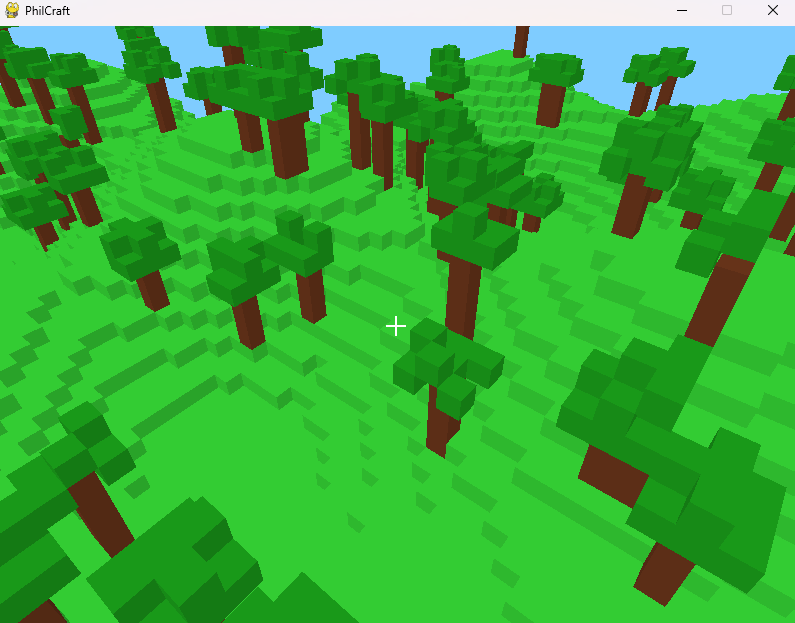

# PhilCraft

A Minecraft-inspired voxel game built with Python, OpenGL, and Pygame. Explore, build, and modify a procedurally generated world with block-based building mechanics.

## Features

- **3D Voxel World**: Fully rendered 3D world with chunked terrain generation
- **Multiple View Modes**: Switch between first-person and third-person perspectives
- **Block Building**: Place and remove blocks with realistic physics
- **Player Physics**: Gravity, collision detection, and smooth movement
- **Optimized Rendering**: Efficient chunk-based rendering with face culling
- **Creative Flight**: Toggle between walking and flying modes
- **Crosshair Targeting**: Visual targeting system for precise block placement

## Screenshots



## Requirements

### Dependencies

```
pygame
numpy
PyOpenGL
PyOpenGL_accelerate (optional, for better performance)
```

### System Requirements

- Python 3.6 or higher
- OpenGL 2.1 compatible graphics card
- At least 2GB RAM
- Windows, macOS, or Linux

## Installation

1. **Clone the repository:**
   ```bash
   git clone <your-repository-url>
   cd philcraft
   ```

2. **Install required dependencies:**
   ```bash
   pip install pygame numpy PyOpenGL PyOpenGL_accelerate
   ```

3. **Run the game:**
   ```bash
   python minecraft11.py
   ```

## Controls

| Key/Action | Function |
|------------|----------|
| **WASD** | Move around (forward/left/backward/right) |
| **Mouse** | Look around (camera rotation) |
| **Space** | Move up / Jump |
| **Shift** | Move down / Sneak |
| **Left Click** | Remove block |
| **Right Click** | Place block |
| **F** | Cycle view modes (First Person → Third Person Back → Third Person Front) |
| **G** | Toggle game mode (Walking/Flying) |
| **R** | Reset camera position |
| **ESC** | Exit game |

## Game Modes

### Walking Mode
- Realistic gravity and physics
- Jump mechanics with Space key
- Collision detection with terrain

### Flying Mode
- Free movement in all directions
- No gravity effects
- Perfect for building and exploration

## View Modes

1. **First Person**: Traditional Minecraft-style first-person view
2. **Third Person Back**: Camera positioned behind the player
3. **Third Person Front**: Camera positioned in front of the player

## Block Types

The game currently supports several block types:

- **Grass** (Green): Basic terrain block
- **Stone** (Gray): Solid building material
- **Leaves** (Dark Green): Tree foliage
- **Wood** (Brown): Tree trunks and building material

## Technical Features

### Chunk System
- World divided into 16x16 block chunks
- Dynamic chunk loading and unloading
- Optimized rendering of visible chunks only

### Collision Detection
- Precise AABB (Axis-Aligned Bounding Box) collision
- Prevents placing blocks inside the player
- Smooth collision response

### Raycast System
- Accurate block targeting up to 5 blocks away
- Face-aware block placement
- Precise hit detection for block removal

### Performance Optimizations
- Face culling for hidden block faces
- Chunk-based rendering
- Distance-based rendering limits
- Efficient OpenGL usage

## File Structure

```
philcraft/
├── minecraft11.py      # Main game file
├── raycast.py         # Raycast system for block interaction
├── block.py           # Block class definition
├── player.py          # Player model and animation
├── camera.py          # Camera system and controls
├── mcchunk.py         # Chunk management system
├── world.py           # World generation and management
└── README.md          # This file
```

## Development

### Adding New Block Types

To add new block types, modify the `colors` dictionary in `MinecraftGame.__init__()`:

```python
self.colors = {
    1: (0.2, 0.8, 0.2),  # Grass green
    2: (0.1, 0.6, 0.1),  # Dark green (leaves)
    3: (0.6, 0.6, 0.6),  # Stone gray
    4: (0.4, 0.2, 0.1),  # Brown (tree trunk)
    5: (1.0, 1.0, 0.0),  # Your new block (yellow)
}
```

### Modifying World Generation

World generation logic is handled in `world.py`. You can modify the `generate_terrain()` method to create different landscape features.

### Performance Tuning

Key performance settings can be adjusted in the respective files:
- Render distance: `world.py`
- Chunk size: `mcchunk.py`
- Target FPS: `minecraft11.py` (clock.tick value)

## Troubleshooting

### Common Issues

**Game won't start / OpenGL errors:**
- Ensure your graphics drivers are up to date
- Verify OpenGL 2.1+ support on your system
- Try installing PyOpenGL_accelerate for better performance

**Low FPS:**
- Reduce render distance in world settings
- Close other applications to free up system resources
- Consider reducing chunk generation complexity

**Controls not responding:**
- Make sure the game window has focus
- Check that mouse capture is working (cursor should be hidden)
- Try pressing ESC to exit and restart

### Debug Information

The game prints debug information to the console including:
- FPS (Frames Per Second)
- Number of chunks rendered
- Total blocks in view
- Camera position

## Contributing

Contributions are welcome! Please feel free to submit pull requests or open issues for bugs and feature requests.

### Development Setup

1. Fork the repository
2. Create a feature branch
3. Make your changes
4. Test thoroughly
5. Submit a pull request

## License

Permission is hereby granted, free of charge, to any person obtaining a copy of this software and associated documentation files (the “Software”), to deal in the Software without restriction, including without limitation the rights to use, copy, modify, merge, publish, distribute, sublicense, and/or sell copies of the Software, and to permit persons to whom the Software is furnished to do so, subject to the following conditions:

The above copyright notice and this permission notice shall be included in all copies or substantial portions of the Software.

THE SOFTWARE IS PROVIDED “AS IS”, WITHOUT WARRANTY OF ANY KIND, EXPRESS OR IMPLIED, INCLUDING BUT NOT LIMITED TO THE WARRANTIES OF MERCHANTABILITY, FITNESS FOR A PARTICULAR PURPOSE AND NONINFRINGEMENT. IN NO EVENT SHALL THE AUTHORS OR COPYRIGHT HOLDERS BE LIABLE FOR ANY CLAIM, DAMAGES OR OTHER LIABILITY, WHETHER IN AN ACTION OF CONTRACT, TORT OR OTHERWISE, ARISING FROM, OUT OF OR IN CONNECTION WITH THE SOFTWARE OR THE USE OR OTHER DEALINGS IN THE SOFTWARE.

## Credits

- Built with Python, OpenGL, and Pygame
- Inspired by Minecraft
- Made with claude.ai

## Changelog

### Version 1.0
- Initial release
- Basic world generation
- Block placement and removal
- Multiple view modes
- Physics system

---

**Enjoy building in PhilCraft!** 🎮⛏️